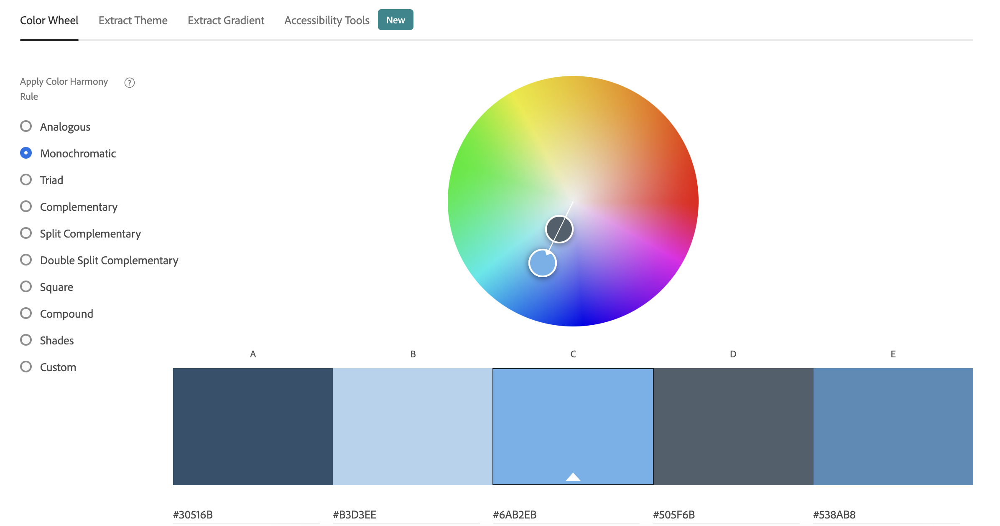

Assignment 1 - Hello World: Basic Deployment w/ Git, GitHub, Glitch
===

Alex Bolduc
http://a1-alexbolduc.glitch.me

This project shows ...

## Technical Achievements
- **Styled page with CSS**: Added rules for li, ul, header, h2, h3 and more elements (10 rules total)
- **Javascript Animation**: "Visit my website link" had an animated background color
- **Additional HTML Tags**: Used ```<header>, <section>, , <br />, <span>```

### Design Achievements
- **Used the Roboto Font from Google Fonts**: Roboto used for the text on the website

#### Color Palette:



#30516B - Used as main background color

#B3D3EE - Used as main text color throughout

#6AB2EB - Used to color Name in header h1

#505F6B - Used as background color for li elements

#538AB8 - Used as one of the carousel of colors for the visit my website link