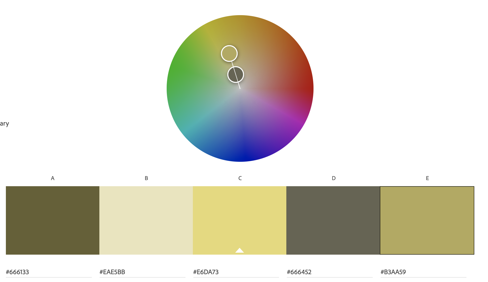

Assignment 1 - Hello World: Basic Deployment w/ Git, GitHub, Glitch
===

Cole Manning
https://a1-rvrx.glitch.me/

## Technical Achievements
1. Styles page with CSS: added rules for body (1), table (2), td (3), and a class for positive (4) and negative (4)
2.  JS Animation: Used JS Function to show/hide experience table
3. Extra tags: `table`/`thead`/`td`/`tr` (1), `style` (2), `em` (3), `ul`/`li` (4), `div` (5)

### Design Achievements
- **Used the Roboto Font from Google Fonts**: I used Source Sans Pro as the font for the text in my site.
- **Used the Adobe color palette**: 