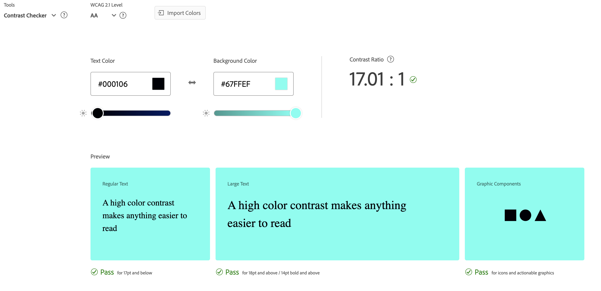

Yueting Zhu
https://a1-aiex05.glitch.me/

This project shows my personal introduction and this is for HW1 in CS4445 Webware

## Technical Achievements
- **Styled page with CSS**: Added rules for the p , h1, h2, s, ol
- **** margin-top, margin-bottom, margin-right, margin-left, boarder-top, color, background, font-size
- **Simple Java script**: Flashing text!
- **HTML tags**: Hyperlinks a; Ordered lists ol; Head 3 h3; Head 4 h4; Head 5 h5; Head 6 h6; Striketrhough s;

### Design Achievements
- **Used the Contrail One Font from Google Fonts**: I used Indie Flower as the font for the main title of my site
- **Used the Adobe color**: 