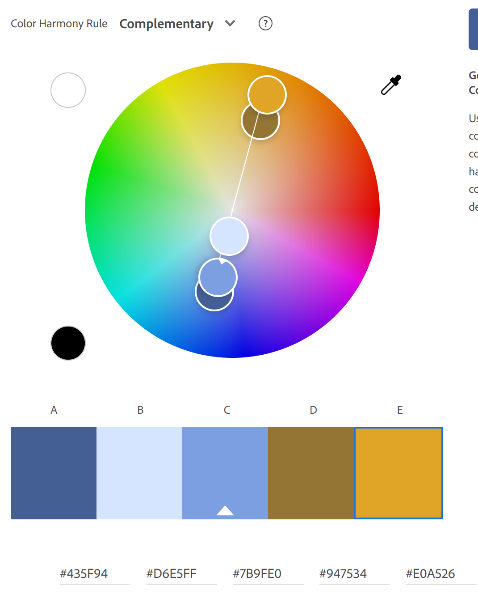

Nikesh Walling
https://a1-nikeshwalling.glitch.me/

This project shows some very basic information about myself. It lists my
activites, previous classes, and some basic programming proficiencies.

## Technical Achievements

### **Additional Elements**

I used attional HTML elemtents on the page including <`table`>, <`button`>,
<`a`> for links, an unordered list,and an SVG image.

### **Styled page with CSS**:

Added rules for the body, h1 headers, lists, tables,
a button,
and applied a mask using an SVG.

- For the body styling was used to set the background color for the site.

- The <`h1`> header was styled so that the text had a coloted underline.

- The lists were styled so that the dot preceding the text was one of the
  theming colors.

- The table was styled so that the words had some additional padding and that
  each cell had a border around them.

- The mask was applied to a <`div`> element to restrict the background color to
  the shape of the SVG.

- Finally, the button was styled so that its shape was changed, it had a border,
  and was indented on the screen.

### **Animation and Image**

I also created and animation using an additional JavaScript file and an SVG I
downloaded from https://commons.wikimedia.org/wiki/File:DVD_logo.svg. The
animation involed two <`div`> elements with boxes drawn on them through CSS
styling. A mask using the SVG was then applied to one of the boxes in order to
use the outline of the image.

## Design Achievements

- **Used the Roboto Font from Google Fonts**: I used Roboto as the font for the
  primary copy text in my site, and I used serif as a backup font.
- **Color Palette from Adobe**
  I created a color palette using the Adobe Color website and had the following
  colors in the palette: - #435f94; - #d4e0fc; - #7b9fe0; - #947534; - #e0a526;

