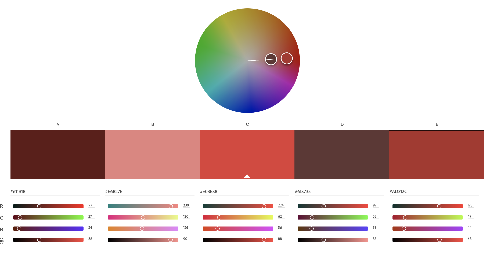

Assignment 1 - Hello World: Basic Deployment w/ Git, GitHub, Glitch
===
Nathan Pollock

https://a1-npollock1414.glitch.me/

This project shows basic information about me.

## Technical Achievements
- **Styled page with CSS**: Added rules for:
    * h1, h2, h3
    * ui, li
    * table, th, td
    * img
    * body
- **Added JavaScript animation**: Added a simple slideshow to the page that changes the image when clicked on.

- **Experimented with other HTML tags**: Added extra tags including:
    * table, th, td
    * img
    * div
    * span
    * a
    * h3

### Design Achievements
- **Used the Bebas Neue font from Google Fonts**: Used the Bebas Neue font in the h1 and h2 tags.
- **Used the Coolors color palette generator**: <a href="https://coolors.co/palette/264653-2a9d8f-e9c46a-f4a261-e76f51" target="_blank">My Palette</a> 
    * #264653 - Background And Text Color
    * #E9C46A - Card Background and Header Color
    * #E76F51 - Button Color
    * #F4A261 - Table Border/Hover Color
    * #2A9D8F - Card Border Color

