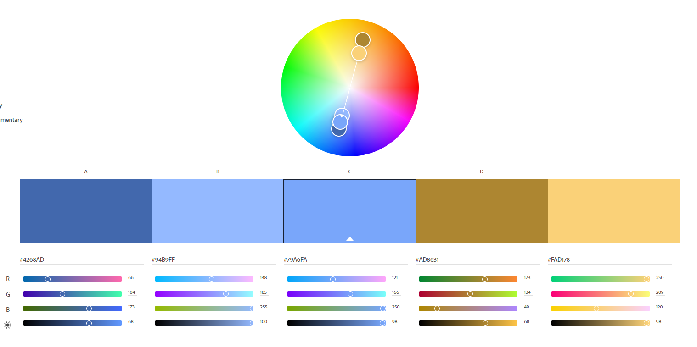

Assignment 1 - Hello World: Basic Deployment w/ Git, GitHub, Glitch
===

Michael Emerson
http://a1-memerson12.glitch.me

This project shows some basic information about me!

## Technical Achievements

- **Styled page with CSS (On the following)**
    - body
    - table, th, td
    - tr
    - Multiple CSS classes
- **Added a fade-in animation on load using JavaScript**
- **Used the following additional HTML elements**
    - div
    - img
    - table
    - tr
    - th
    - td
    - ul
    - li

### Design Achievements

- **Used the Nunito Font from Google Fonts**: I used Nunito as the font for the text in my site.
- **Used Colors generated from https://color.adobe.com/:** I used as #2C3E50 the underline color for my header, #79AADB
  as the color that appears when hovering over an item in the table, #56799C as the boarder color in my table, #32475C
  as the background color of the two boxes, and #1D2A36 as the background color for the page
  
