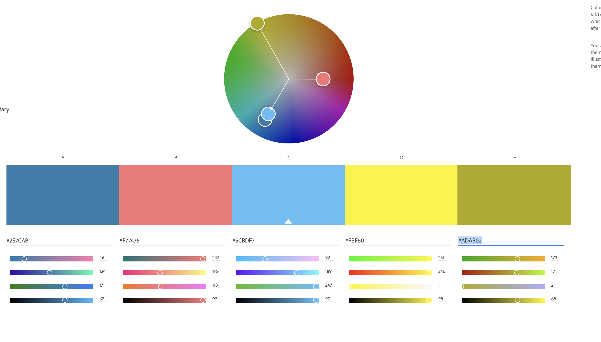

Jacob van Steyn
https://a1-jacobvs.glitch.me/

This project shows:

## Technical Achievements
- **Styled page with CSS**: Added rules for the body, footer, header, section, p, h2, h3, ul, and a selectors.
- **Added js/css animation**: Added a simple preloader wheel that spins while the page is "loading" (static site so simply used timeout)
- **Used HTML Tags**: Added various html elements such as ul/li, links, images, sections, header, footer, etc.

### Design Achievements
- **Used the Ralewway Font from Google Fonts**: I used Raleway as the font for the primary text in my site.
- **Used a Color Palette**: Used a color Palette in site elements which has been uploaded to this repo as Palette.png: 