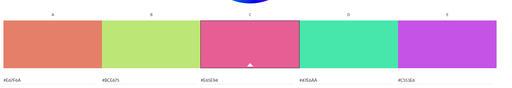

Siddhartha Pradhan

https://a1-siddharthapradhan.glitch.me/

This project is a simple website that displays my information and some of my technical skills. I did not use any external libraries, just plain old JS, HTML and CSS.

## Technical Achievements
- **Styled page with CSS**: Added rules for:
    - body -> light and dark background using background-color property, font using font-family property.
    - h1/h2/h3 -> changing text colors using color property, utilizing a class selector.
    - table -> changing alignment using text-allign property and improved border appearance using border, border-collapse property.
    - image -> changing image size using width and height property.
    - HTML5 canvas -> changing size using width and height property and changing border using border property, using id selector.
    - flex-container -> changing the way a div's elements are displayed by changing display property to flex, and justify-content property to space items evenly.
    - list element -> changing list element appearance using list-style-type property and adding padding using padding-left property.
I learned to combine different classes to get a user-friendly UI, ex: light mode/ dark mode toggle, with each important HTML element being part of a dark-theme or light theme class.

- **Java Script Animation**: Added a changing looping animation that were made using pure js (no external libs). Animations included:
    - color changing sinwave
    - an expanding bubble animation 
    - a black fade out animation. 
This was particularly challenging as I had not worked with async functions before, and animations in the canvas took a lot of customizing/trial-and-error to appear smooth.
    

- **Aditional HTML Tags**: Experimented and added the following tags:
    - DIV -> container element to group two or more elements, I used it for styling purposes.
    - INPUT -> to get user input, I used a checkbox which I then styled to appear as a slider to switch between light-mode and dark-mode.
    - BR -> tag to add breaks between sections.
    - IMG -> to load in an image, I used this tag to load in a gif.
    - TABLE -> to organize data, I used this to organize my technical experience in a user friendly and intuitive way.
    

## Design Achievements
- **Color Palette**: Utilized color palette using color.adobe.com to add more flair to the text.

- **Used the Share Tech Mono Font from Google Fonts**: I used Share Tech Mono as the font for the primary text in my site, using monospace as a backup.
