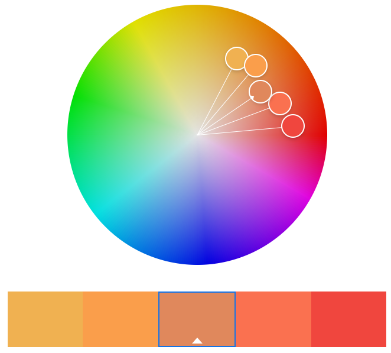

# Assignment 1 for CS4241
## Link to the Page
Page Link: https://a1-hao-oliverchen.glitch.me/      

## Technical Achievements
(max 5 points) Style my page using CSS
1. For the only two headers that I used in this assignment, I set the texts to be centered for their alignment (better reading experience for the user).
2. I disable the default bullet point and then change the bullet point color to #F0463E. I bolded the bullet point as well as changed the margin and width.
3. I defined a coloredBorder class in div tag so that I can display a rounded border for some of my header levels. 
4. I defined a video wrapper for my Iframe element so that the width-hight ratio is always 16:9 (aspect ratio for normal youtube video).
5. I defined a center class to center some of my contents in the page.    

(max 5 points) Experiment with other HTML tags
1. Iframe tag for the game trailer.
2. Anchor tag for links to the Apple store and Google Play 
3. Image tag for Apple store and Google Play images
4. some other trivial tags such as bold, strong, break line and etc.

---

## Design/Usability Achievements
(10 points) Using color palette   
   

1. Color from left to right: #F0B151 (used in "border"), #FA9E4B (used in "h1" and "h2"), #E0885C (used in "h2 - Get Low, Grandpa!" and the video description), #FA7150 (used in "h3"), #F0463E (used in bullet point).
    
(5 points) Using Google Font     
1. In this page, I used <strong>Abel</strong> from Google fonts for all my body content.

