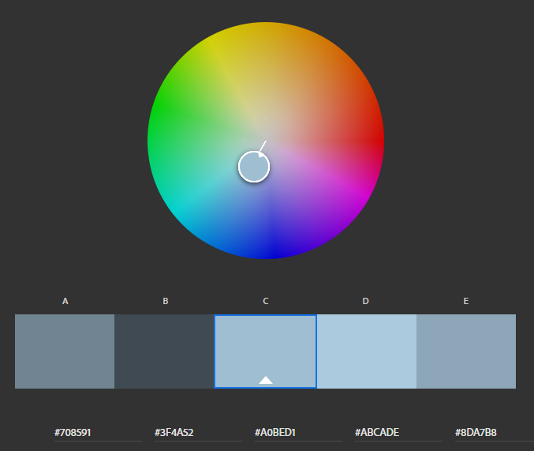

Assignment 1 - Hello World: Basic Deployment w/ Git, GitHub, Glitch
===

Cameron Jacobson
website link here

GH username: CJACOBSON32

## Technical Achievements
- **Styled page with CSS**: Added rules for pretty much every type of element
  - Made a rule for "content" class that constrained all website content into a form factor that could fit whatever
    browser it was being rendered on.
  - Made "Hello" a different color from the color wheel
  - Made every element on the page load in with a fade-in entrance
  - made classes for vboxes and hboxes to arrange elements
  - Adjusted the margins of several elements to make the spacing neater
- Used the p5 js library to make a javascript painting toy at the bottom of the site
  - Also made a button that scrolls the page down
- Used some other html5 elements
  - Section
  - Image
  - link (to the website for Planetside 2, my current favorite videogame)
  - Button
  - Canvas

### Design Achievements
- **Used a color palette from Adobe color wheel:** I used all 5 colors from the color scheme

- **Used the Roboto Font from Google Fonts**: I used Roboto as the font for the primary copy text in my site.

Charlie Roberts
http://a1-charlieroberts.glitch.me

This project shows ...

## Technical Achievements
- **Styled page with CSS**: Added rules for the p, li, and a selectors...

### Design Achievements
- **Used the Roboto Font from Google Fonts**: I used Roboto as the font for the primary copy text in my site.
